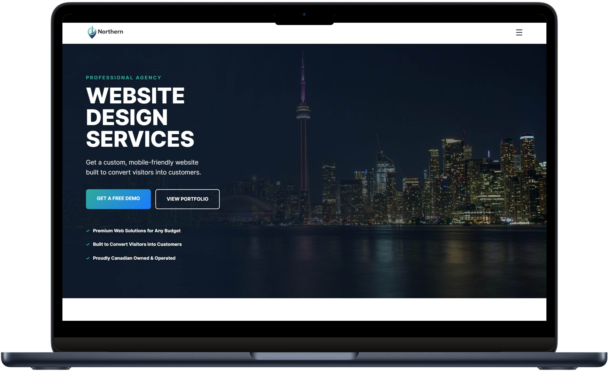
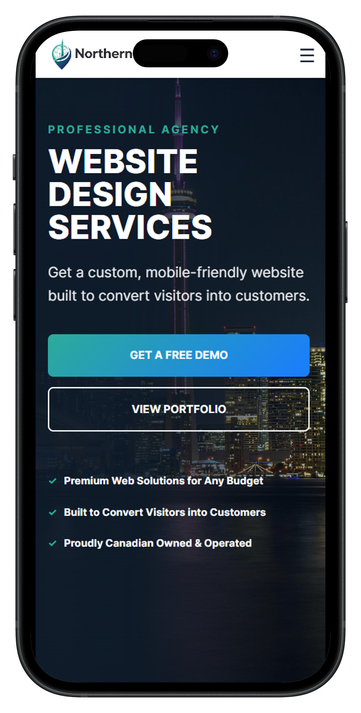

# 🌐 Northern Web | Professional Web Design

### _Building fast, accessible, and responsive digital solutions to bridge the gap between local shops and the modern web._

**Northern Web** is a high-performance, conversion-focused landing page tailored for small businesses in the Ontario market. It combines clean **Semantic HTML5**, **Modern CSS Architecture**, and a **Mobile-First** philosophy to deliver a premium user experience.

---

## 🔗 Live Demo

View the live project here:
👉 [**Explore Northern Web Live**](https://northernweb.vercel.app)

---

## 📱 The Showcase

  
  

> **Design Note:** The interface is engineered for maximum performance across all device tiers, utilizing custom safe-area logic for modern mobile displays.

### 🚀 What It Does

- **Mobile-First Design:** Builds fully responsive websites that look great on any screen.
- **Visual Strategy:** Applies high-level design skills to create visually pleasing interfaces.
- **Business Growth:** Focuses on **clarity, speed, and client conversions** to help service-based businesses grow.
- **Local Focus:** Specifically designed to meet the needs of local companies and service-based businesses.

### 🛠 Tech Stack

- **HTML5**
- **CSS3**
- **JavaScript**
- **Responsive Design**
- **AI-Enhanced Workflow:** Developed using AI assistants for rapid ideation, debugging, and creation.

---

## ⚙️ Development Standards

- **Clean Code:** Minimalist, zero-dependency **Vanilla JS** for peak performance.
- **Accessibility:** Semantic **HTML5** structure built for screen readers and SEO.
- **Modern CSS:** Scalable, modular architecture using **Flexbox, Grid, and Variables**.
- **Mobile-First:** Engineered for fluid responsiveness across all modern device tiers.
- **AI-Augmented:** Leveraging **AI-Enhanced Workflows** for rapid ideation and refactoring.

---

### 🧠 What I’m Learning

- **Effective Layouts:** Translating business needs into simple, effective web structures.
- **Attention to Detail:** Mastering performance, readability, and visual hierarchy.
- **Modern Efficiency:** Leveraging AI tools to maximize development workflow and speed.

---

## 📈 Current Focus & Next Steps

- **🏗️ Site Construction:** Finalizing the responsive layout and internal logic for the Northern Web prototype.
- **📚 Skill Expansion:** Refining core HTML/CSS/JS fundamentals while learning the business side of web development.
- **🛠️ Future-Proofing:** Preparing the architecture to eventually support backend features and professional client tools.

---

_The foundational build for my upcoming web agency. This repository establishes the high-performance technical standards for all future client work._
